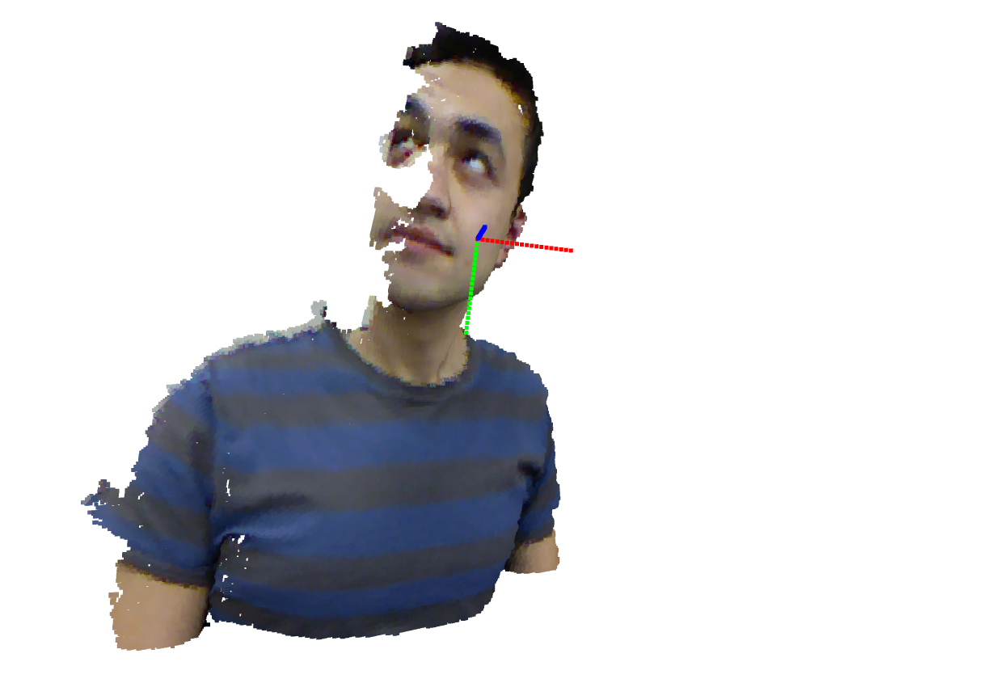

# BIWI dataset visualization with point cloud

The program contains following parts:

- Converting depth map to point cloud
- Mapping 2D color to attach each point in point cloud
- Generating pose axis in point cloud format
- Combining axis with fusion point cloud

More details in Chinese have been uploaded to my [CSDN](https://blog.csdn.net/weixin_43038346/article/details/120097266?spm=1001.2014.3001.5501) blog. 

For your convenience, I uploaded some samples at file `source`, three random frames are selected from volunteer No. 12. 

To run the program in Jupyter notebook, the `requirements.txt` is already generated. If you want to run in Python, you just need `opencv` *(optional)* and `open3d`. 